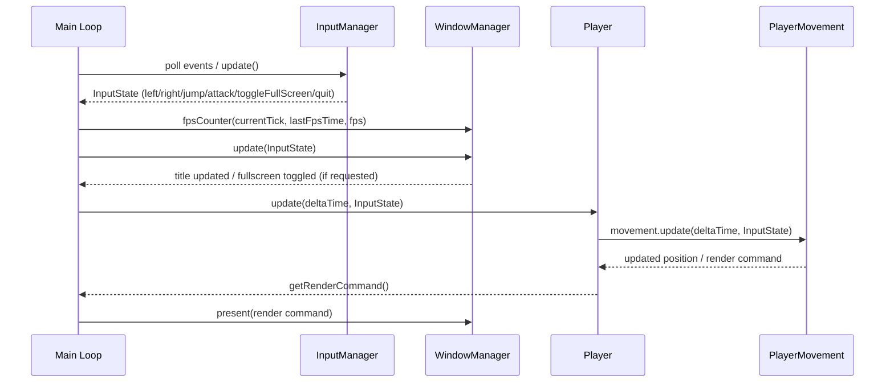

> Below is the prequisites for Windows OS, but follow the generalized steps for other OS

# Prerequisites

- [MinGW (g++) v2.5.0](https://github.com/skeeto/w64devkit/releases)
  - requires g++ version 15.0.0 or higher
- [SDL3 v3.4.0](https://github.com/libsdl-org/SDL/releases/tag/release-3.4.0)
  - Perform `Extract here` with winrar and move the folder to `C:/` and rename it to `SDL3`
- [GNU Make](https://www.gnu.org/software/make/)
  - I installed using [Chocolatey](https://chocolatey.org/) with PowerShell administrator
  ```
  choco install make
  ```
- Visual Studio Code (C/C++ extension) setup
  - save SDL3 folder inside the `C:/` folder
  - create a folder named `.vscode` in the root of the project
  - create a file named `c_cpp_properties.json` in the `.vscode` folder
  - copy the following code into the file
    ```json
    {
      "configurations": [
        {
          "name": "Win32",
          "includePath": [
            "${workspaceFolder}/**",
            "${workspaceFolder}/include",
            "${workspaceFolder}/include/Engine",
            "${workspaceFolder}/include/Gameplay",
            "${workspaceFolder}/include/Core",
            "${workspaceFolder}/include/Utils",
            "C:\\SDL3\\x86_64-w64-mingw32\\include"
          ],
          "defines": ["_DEBUG", "UNICODE", "_UNICODE"],
          "compilerPath": "C:\\w64devkit\\bin/g++.exe",
          "cStandard": "c11",
          "cppStandard": "c++20",
          "intelliSenseMode": "windows-gcc-x64"
        }
      ],
      "version": 4
    }
    ```

# Build

- Open the project in Visual Studio Code
- Open the Terminal
- Run `make`
- Run `make clean` to clean the build for the next build

# Project Structure

```
project/
├── src/
│ ├── main.cpp
│ ├── Engine/
│ │ ├── WindowManager.cpp / .h
│ │ ├── Renderer.cpp / .h
│ │ ├── AudioManager.cpp / .h
│ │ └── InputHandler.cpp / .h
│ ├── Gameplay/
│ │ ├── ECS/
│ │ ├── AI/
│ │ ├── Combat/
│ │ ├── Player/
│ │ └── Enemy/
│ └── Utils/
│ ├── Logging.cpp / .h
│ ├── Math.cpp / .h
│ └── Timer.cpp / .h
├── include/
├── assets/
│ ├── sprites/
│ ├── audio/
│ └── levels/
├── build/
├── Makefile
└── README.md
```

# Branches

- main
  - The main branch of the project. This branch is the one that is being used for the actual gameplay.
- dev
  - The dev branch is the branch that is used for development. It is a copy of the main branch, but with the code that is being worked on.
- feature/branch-name
  - Branches that are used for developing new features or bug fixes.

# Contribution

- Clone the project
- Create a branch for your feature/bug fix
  `git checkout -b feature/branch-name`
- Make your changes
- Commit your changes
- Push your changes
- Create a pull request
