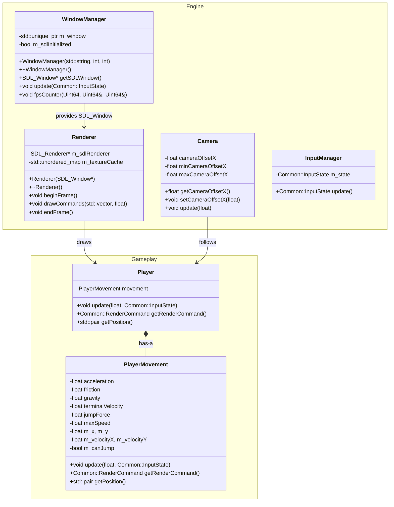
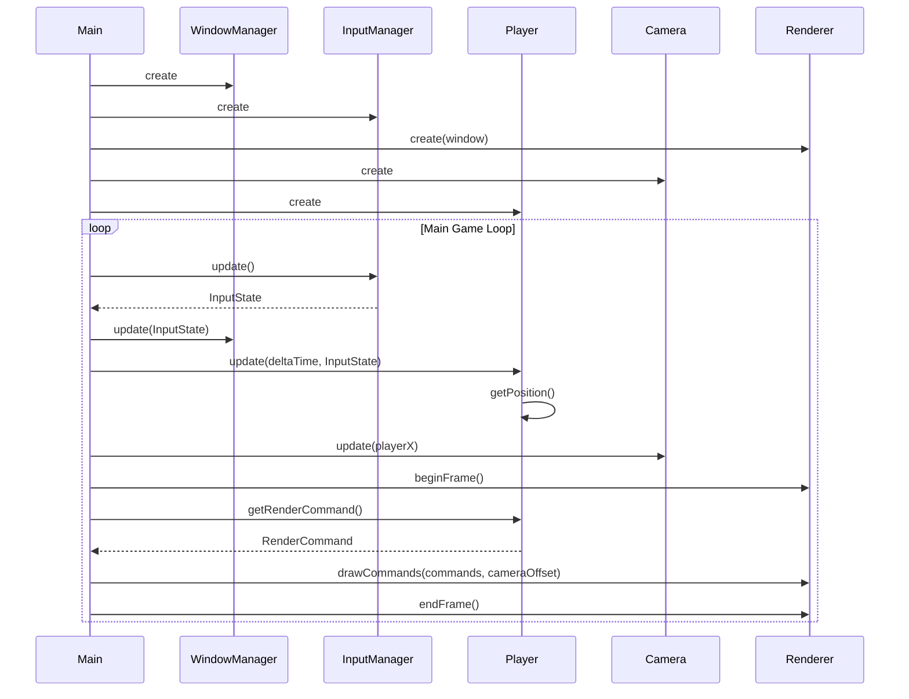

# UML Diagrams for C++ 2D Game

This document contains UML diagrams generated using Mermaid for the current codebase.

## Class Diagram

```mermaid
classDiagram
    namespace Engine {
        class Camera
        class WindowManager
        class Renderer
        class InputManager
    }
    namespace Gameplay {
        class Player
        class PlayerMovement

    }

    class Camera {
        -float cameraOffsetX
        -float minCameraOffsetX
        -float maxCameraOffsetX
        +float getCameraOffsetX()
        +void setCameraOffsetX(float)
        +void update(float)
    }

    class WindowManager {
        -std::unique_ptr<SDL_Window, SDLDeleter> m_window
        -bool m_sdlInitialized
        +WindowManager(std::string, int, int)
        +~WindowManager()
        +SDL_Window* getSDLWindow()
        +void update(Common::InputState)
        +void fpsCounter(Uint64, Uint64&, Uint64&)
    }

    class Renderer {
        -SDL_Renderer* m_sdlRenderer
        -std::unordered_map<Common::TextureID, SDL_Texture*> m_textureCache
        +Renderer(SDL_Window*)
        +~Renderer()
        +void beginFrame()
        +void drawCommands(std::vector<Common::RenderCommand>, float)
        +void endFrame()
    }

    class InputManager {
        -Common::InputState m_state
        +Common::InputState update()
    }

    class Player {
        -PlayerMovement movement
        +void update(float, Common::InputState)
        +Common::RenderCommand getRenderCommand()
        +std::pair<float, float> getPosition()
    }

    class PlayerMovement {
        -float acceleration
        -float friction
        -float gravity
        -float terminalVelocity
        -float jumpForce
        -float maxSpeed
        -float m_x, m_y
        -float m_velocityX, m_velocityY
        -bool m_canJump
        +void update(float, Common::InputState)
        +Common::RenderCommand getRenderCommand()
        +std::pair<float, float> getPosition()
    }

    WindowManager --> Renderer : provides SDL_Window
    Player *-- PlayerMovement : has-a
    Renderer --> Player : draws
    Camera --> Player : follows
```

## Sequence Diagram

```mermaid
sequenceDiagram
    participant Main
    participant WindowManager
    participant InputManager
    participant Player
    participant Camera
    participant Renderer

    Main->>WindowManager: create
    Main->>InputManager: create
    Main->>Renderer: create(window)
    Main->>Camera: create
    Main->>Player: create

    loop Main Game Loop
        Main->>InputManager: update()
        InputManager-->>Main: InputState
        Main->>WindowManager: update(InputState)
        Main->>Player: update(deltaTime, InputState)
        Player->>Player: getPosition()
        Main->>Camera: update(playerX)
        Main->>Renderer: beginFrame()
        Main->>Player: getRenderCommand()
        Player-->>Main: RenderCommand
        Main->>Renderer: drawCommands(commands, cameraOffset)
        Main->>Renderer: endFrame()
    end
```
